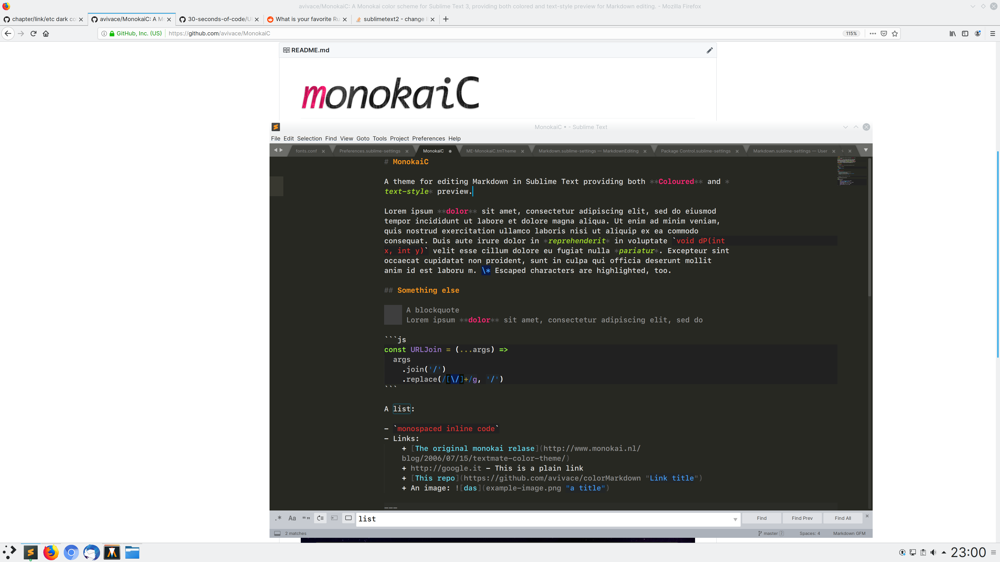
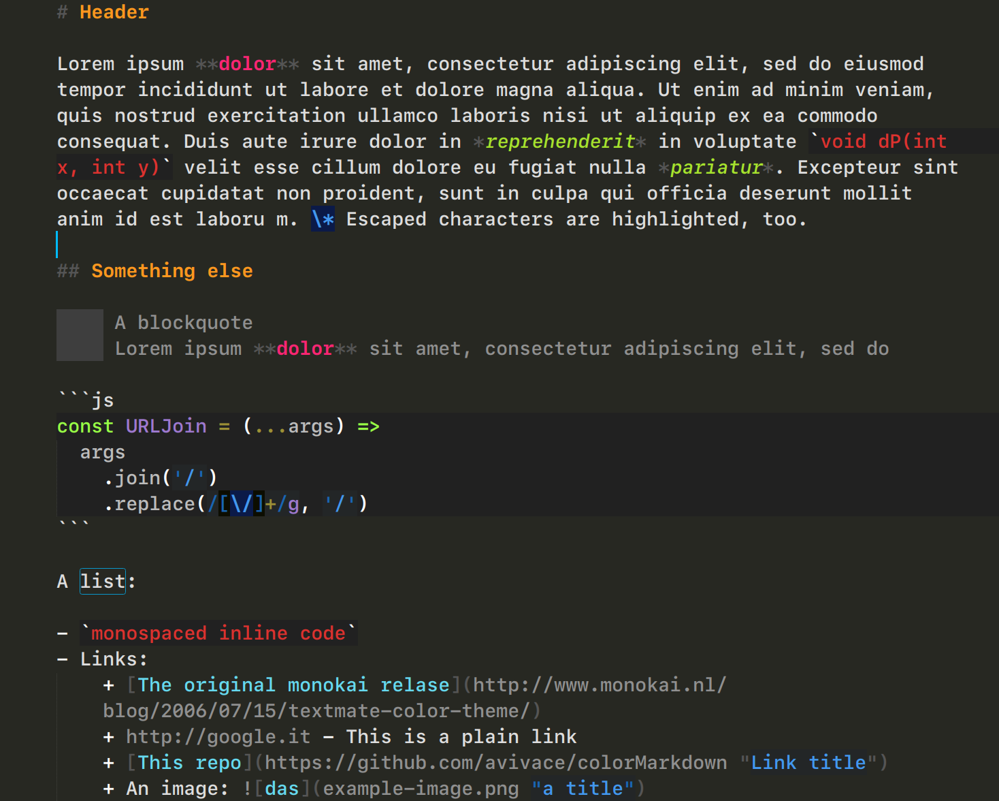
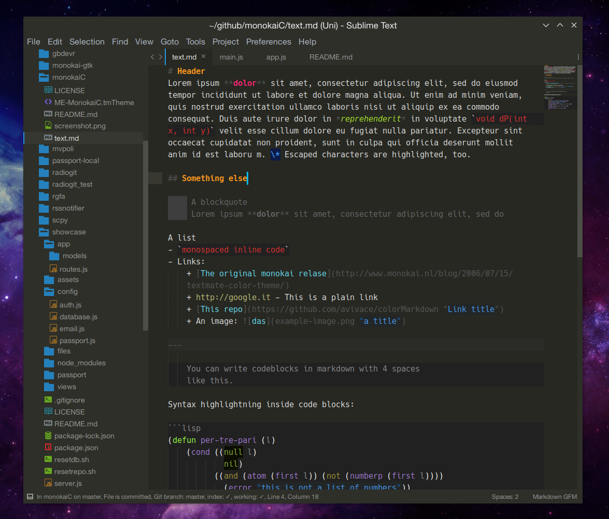

# 

[](https://packagecontrol.io/packages/MonokaiC)

A monokai theme for the [MarkdownEditing](https://github.com/SublimeText-Markdown/MarkdownEditing) package for Sublime Text 3 providing both **Coloured** and **text-style preview** for Markdown.



## Install

First, install [MarkdownEditing](https://github.com/SublimeText-Markdown/MarkdownEditing).

### Package Control

- `Ctrl/Command + Shift + P` to open the Command Palette
- Select `Package Control: Install Package`
- Search for `MonokaiC`
- Press `Enter`

### Manual

```bash
git clone https://github.com/avivace/MonokaiC ~/.config/sublime-text-3/Packages/MonokaiC
```
> Change the target directory with `~/Library/Application\ Support/Sublime\ Text\ 3/Packages/MonokaiC` on OS X and `%appdata%\Sublime Text 3\Packages\MonokaiC` on Windows.

### Activation

To enable the theme, open your preferred MarkdownEditing User setting file from `Preferences > Package Settings >  Markdown Editing > Markdown GFM Settings - USER` (works with MultiMarkdown and Markdown Standard too) and put this:

```
{
    "color_scheme": "Packages/MonokaiC/themes/ME-MonokaiC.tmTheme",
}
```

Be sure to Set Syntax -> MarkdownEditing -> Markdown GFM on your Markdown files

## Preview



