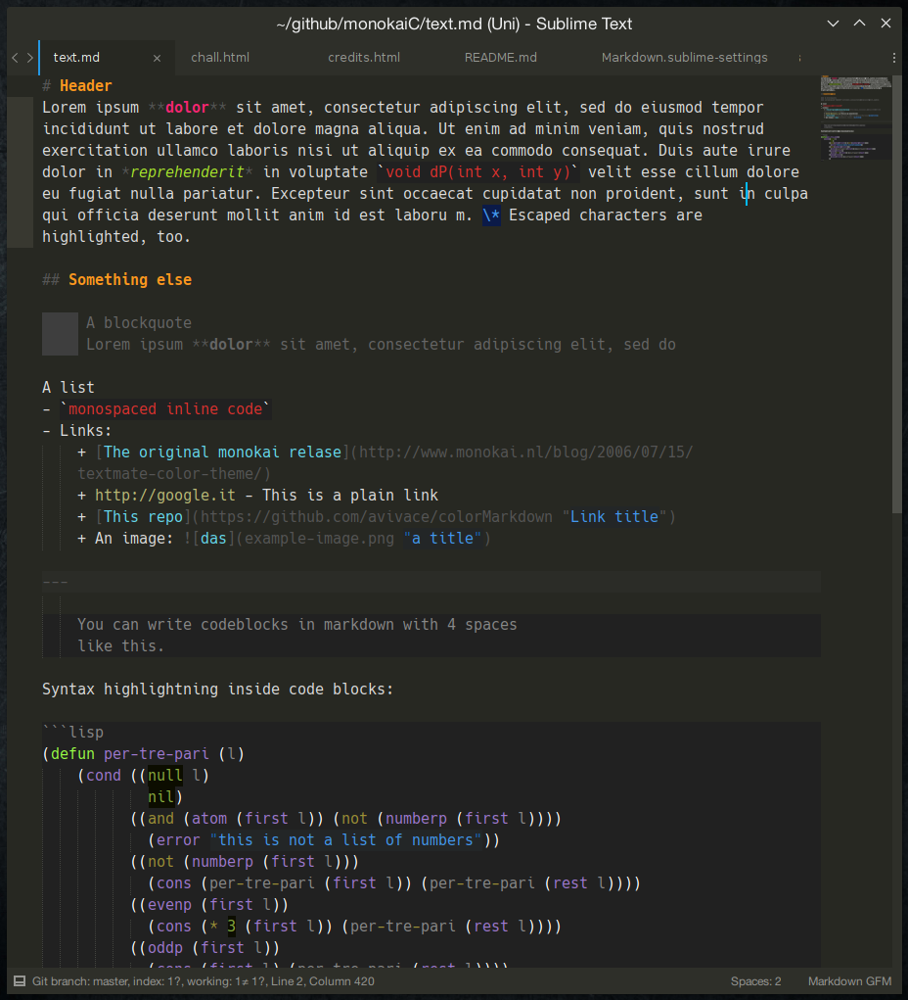

# 

A monokai theme for the [MarkdownEditing](https://github.com/SublimeText-Markdown/MarkdownEditing) package for Sublime Text 3 providing both **Coloured** and **text-style preview** for Markdown.

## Install
Clone this repo (`git clone https://github.com/avivace/monokaiC`) and copy `ME-MonokaiC.tmTheme` to the Sublime Text User Package folder (`~/.config/sublime-text-3/Packages/User/` on Linux or `~/Library/Application\ Support/Sublime\ Text\ 3/Packages/User/` on OS X).

Open your preferred MarkdownEditing User setting file from `Preferences > Package Settings >  Markdown Editing > Markdown GFM Settings - USER` (works with MultiMarkdown and Markdown Standard too).

Enable the theme:

```json
{
    "color_scheme": "Packages/User/ME-MonokaiC.tmTheme",
    "extensions":
    [
        "md"
    ]
}
```

## Preview

